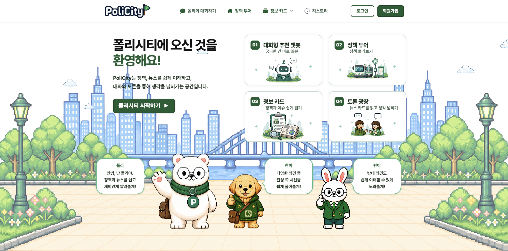
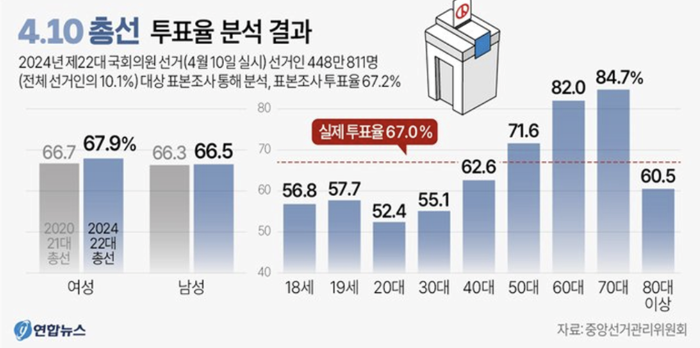

# SK네트웍스 Family AI 캠프 24기 최종 프로젝트

 
 
# 1. 팀 소개
## **좌우지간**
 

| 박정은 | 전윤우 | 나혜린 | 김현수 | 김은우 |
| :---: | :---: | :---: | :---: | :---: |
|   |  |  |  |  |

 

# 2. 프로젝트 개요

## 2-1. 프로젝트 명

## 2-2. 프로젝트 소개
- 청년층의 정치 참여 장벽을 낮추기 위해 설계된 AI 기반 정치 입문 플랫폼

## 2-3. 서비스 소개
### 2-3-1. 뉴스 카드 및 정책 카드(정보 카드)
- 뉴스 카드
  - 특정 이슈에 대해 핵심 내용을 요약하고, 청년 일상과의 연관성을 여러 기사들을 통해 설명하고, 정책 카드의 경우 청년과 관련된 정책의 핵심 내용을 요약하고 일상과의 연관성을 설명

- 정책 카드
  - 청년 정책의 지원 대상, 신청 및 마감 날짜, 혜택 의 내용을 확인할 수 있고, 해당 정책에 대한 찬성 및 반대 의견을 중립적으로 제시

### 2-3-2. 토론
- 사용자가 찬반 입장을 선택하여 AI와 1대 1로 토론하는 기능 (AI vs. User)
- 찬성 AI와 반대 AI간 토론을 참관하는 기능 (AI vs. AI)

### 2-3-3. 대화형 추천 챗봇
- 뉴스 및 정책 관련 대화
- 사용자의 특성(거주지, 연령 등) 및 챗봇과의 대화 내용 기반 맞춤형 뉴스 및 정보 카드 추천

## 2-3. 프로젝트 필요성
### 2-3-1. 청년 정치 참여 현황
- 2024년 4월 10일 총선 투표율을 기준으로 20대 및 30대 투표율 저조

- 청년층이 투표장에 나타나지 않을 수록 국가의 중요한 의사결정에 청년의 목소리가 반영되는 비중 감소

### 2-3-2. 진입 장벽의 문제
- 대학생 설문(KNSU 미디어, 2024)에서 투표가 중요성을 알고 있다고 응답한 비율은 84%, 실제 참여(투표)로 이어지는 비율은 65%
- GIST 학생 설문(n=182)에서 필요성은 인식하고 있지만 실제 참여로 이어지지 않는 주요 이유
   - 정보 접근의 어려움
   - 표현에 대한 부담

### 2-3-3. 토론과 학습의 필요성
- 정치 참여에서 중요한 것은 정보 습득보다  다양한 입장을 직접 접하고 자신의 생각을 정리해보는 과정

# 3. WBS
https://docs.google.com/spreadsheets/d/1lBx_-zMlK1x6_ZCEh6PZAWjJvdMrjnkb/edit?gid=354776593#gid=354776593

# 4. 요구사항 명세서
https://docs.google.com/spreadsheets/d/1opU1mVYwNAtQ2xCDJ8987yVDSA7gmTgXsWlMCGEGv0U/edit?gid=1374958457#gid=1374958457

# 5. 🛠️ 기술 스택
| Category | Stack / Icons |
| :--- | :--- |
| **Frontend / Client** |    |
| **Backend Core** |    |
| **AI Agent Layer** |     |
| **AI / ML Models** |   |
| **Data Pipeline  (Serverless)** |    |
| **Relational Database** |     |
| **Vector Database** |  |
| **Infrastructure  & DevOps** |    |

---

# 5. ERD

# 6. 사용한 모델 및 테스트 결과
## 6-1. 편향 분류 모델(KR-ELECTRA)
- 뉴스 기사 및 카드 텍스트를 보수, 진보, 중립 세 가지로 분류하는 삼진 분류 모델
- 편향된 사설과 중립적 정보 전달 텍스트 명확히 분리

## 6-2. 임베딩 모델(ko-sroberta-multitask)
- 사용자 질문과 관련된 카드 및 원문 데이터를 벡터 검색으로 찾는 임베딩 모델

## 6-3. 답변 생성 모델(GPT-4o-mini)
- 카드 생성, 챗봇, 토론, 발언 생성 전반에 사용하는 모델

## 6-4. 결과 요약
| 모델 | 결과 |
|---|---|
| **KR-ELECTRA** | F1 0.9989, 편향 탐지율 100% / 제목 그룹 중립 정확도 25%, 짧은 제목 입력 시 과잉 판정 발생 |
| **ko-sroberta-multitask** | 카드 컬렉션 HR@1 91.7%, MRR 0.917 / 데이터 컬렉션 HR@3 80%, MRR 0.683 |
| **gpt-4o-mini** | 일부 내용의 근거 보강 필요 / 전 항목 최고 점수 / 반대 의견 설명 시 근거 다소 빈약 / 할루시네이션 억제 2/3 - 일부 미확인 표현 |

# 7. 시스템 아키텍처

# 8. 데이터 수집 및 전처리
- 매일 오전 2시 정기 스케줄러(EventBridge Scheduler)에서 웹 크롤링을 수행하고, 수집된 원천 데이터(Raw Data)는 전처리된 형태로 AWS Fargate에 저장
- 원천 데이터를 전처리한 후 ko-sroberta-multitask 모델을 통해 벡터로 변환하여 임베딩한 값과 구조화된 뉴스 카드 및 정책 카드는 Qdrant에 저장
- ERD 기반 관계형 데이터는 AWS의 RDS(MySQL) 연동

## 8-1. 정책 데이터
### 8-1-1. 정책 데이터

**행정안전부 대한민국 공공서비스(혜택) 정보** 데이터를 수집하여 청년 관련 정책을 선별하고, 정책 카드 생성에 활용

| 목록 | 내용 |
|---|---|
| **데이터명** | 행정안전부 대한민국 공공서비스(혜택) 정보 |
| **수집 건수** | 초기 데이터 10,954건 / 청년 관련 필터링 후 1,690건 |
| **데이터 출처** | 국무조정실 청년정책조정실 |
| **URL** | https://www.data.go.kr/data/15113968/openapi.do |
| **저장 포맷 / 인코딩** | JSON |

#### 전처리

- 수집된 정책 데이터에서 서비스에 직접 사용하지 않는 등록일시, 조회수, 상세조회 URL 등의 필드는 제외
- 서비스 ID, 정책명, 정책 내용, 신청기한, 주관기관, 신청 URL, 수정일시 등 정책 카드 생성에 필요한 핵심 정보를 중심으로 정리
- 값이 비어 있거나 null/nan인 항목은 `정보 없음`으로 통일하고, `||` 구분자와 목록 기호를 읽기 쉬운 형태로 정리

### 8-1-2. 근거 법령 데이터

정책 정보와 연결되는 법령 근거로 활용하기 위해 **법제처 국가법령정보센터**의 조문 데이터를 수집

| 목록 | 내용 |
|---|---|
| **데이터명** | 법제처 국가법령정보 조문 데이터 |
| **수집 건수** | 약 100건 |
| **데이터 출처** | 법제처 국가법령정보센터 |
| **URL** | https://open.law.go.kr/LSO/openApi/guideList.do |
| **저장 포맷 / 인코딩** | JSON / UTF-8 |

#### 전처리

- 수집된 법령 데이터에서 법령명, 조문 번호, 조문 제목, 조문 내용 등 법령 근거 제공에 필요한 정보를 중심으로 정리
- 분리되어 있던 조문내용, 항내용, 호내용을 하나의 조문 본문으로 통합
- `①`, `1.`, `가.`와 같은 항·호·목 번호 앞에 줄바꿈을 넣어 조문 구조가 구분되도록 정리

### 8-1-3. 정책 관련 뉴스 데이터

정책과 관련된 최신 이슈 및 사회적 맥락을 제공하기 위해 **네이버 뉴스 기사**를 수집

| 목록 | 내용 |
|---|---|
| **데이터명** | 네이버 뉴스 기사 |
| **수집 건수** | 약 850건 |
| **데이터 출처** | 네이버 뉴스 |
| **URL** | https://news.naver.com/ |
| **저장 포맷 / 인코딩** | TXT, JSONL / UTF-8 |

#### 전처리

- 크롤링한 뉴스 본문에서 저작권 문구, 공유 버튼, 사이트 내비게이션, 반복 안내 문구 등 기사 내용과 관련 없는 노이즈를 제거
- HTML 태그, 특수 공백, 중복 줄바꿈 등을 일반 텍스트 형식으로 정리
- 동일 URL 및 본문 해시 기준으로 중복 기사를 제거하고, 본문 내용이 부족한 기사는 제외

## 8-2. 뉴스 기사 데이터
청년층의 관심사와 연관된 시의성을 띠는 정치 이슈를 신속하게 전달하는 뉴스 카드 제작 및 토론의 근거자료로 활용

| 목록 | 내용 |
|------|------|
| **데이터명** | 네이버 뉴스 기사 |
| **수집 건수** | 키워드별 찬성 4개, 반대 4개, 중립 2개 수집 |
| **출처 및 저작권** | 네이버 뉴스 |
| **출처** | https://news.naver.com/ |
| **저장 포맷 / 인코딩** | json |

#### 전처리

- 크롤링한 뉴스 본문에서 저작권 문구, 공유 버튼, 사이트 내비게이션, 반복 안내 문구 등 기사 내용과 관련 없는 노이즈를 제거
- HTML 태그, 특수 공백, 중복 줄바꿈 등을 일반 텍스트 형식으로 정리
- 동일 URL 및 본문 해시 기준으로 중복 기사를 제거하고, 본문 내용이 부족한 기사는 제외

# 9. 구현 내용
## 9-1. 뉴스 및 정책 카드

### 9-1-1. 뉴스 카드

청년(20~30대)의 취업, 주거, 금융, 복지, 교육 등 일상과 관련된 사회·경제 이슈 카드.  
머니투데이 이슈키워드에서 청년 관련 키워드를 추출하고, 해당 키워드로 수집한 네이버 뉴스 기사를 바탕으로 키워드 1개당 카드 1장 생성.

| 탭 | 내용 |
|---|---|
| **SUMMARY** | 카드 제목, 카테고리, 핵심 요약 3~5개, 청년 연관성 |
| **CORE** | ① 이슈 배경 ② 무슨 일이 있었나 ③ 언론사별 시각 ④ 청년에게 어떤 영향이 있나 |
| **OPINION** | 언론사별 입장 찬성·지지 최소 2개, 반대·비판 최소 2개 균형 유지 |
| **SOURCE** | 언론사별 원문 링크 |

#### 생성 및 검증 과정

- 사실 추출 → SUMMARY 생성 → CORE / OPINION / 토론 주제 병렬 생성 → 카드 조립 → Qdrant 저장
- CORE는 4개 파트 순차 생성, ①~③ 파트는 KR-ELECTRA 편향 검사 후 실패 시 최대 2회 재생성, ④ 청년 영향 파트는 편향 검사 제외
- OPINION은 Generator → Supervisor 루프 최대 3회로 균형 검증, Constitutional AI로 위반 언론사만 개별 재생성
- 편향 기준 초과 브랜치 존재 시 카드 전체 폐기

### 9-1-2. 정책 카드

청년 관련 정책의 핵심 내용 요약 및 일상 연관성 설명 카드.  
정책 원문, 관련 뉴스, 근거 법령을 입력 데이터로 활용.

| 탭 | 내용 |
|---|---|
| **SUMMARY** | 카드 제목, 카테고리, 핵심 요약 3~5개, 청년 연관성, 지원 대상, 신청 기간, 신청 방법, 문의처 |
| **CORE** | ① 이 정책이 왜 생겼나 ② 정책 내용이 뭔가 ③ 관련 기관·단체 입장 ④ 청년에게 어떤 영향이 있나 |
| **OPINION** | 찬성 논거 / 반대 논거 |
| **SOURCE** | 공식 신청 URL, 정책명, 주관기관 |

#### 생성 및 검증 과정

- 사실 추출 → SUMMARY 생성 → CORE / 찬성 논거 / 반대 논거 병렬 생성 → 카드 조립 → 토론 주제 생성 → Qdrant 저장
- CORE는 ①~③ 파트 KR-ELECTRA 편향 검사 후 실패 시 최대 2회 재생성, ④ 청년 영향 파트는 편향 검사 제외
- 찬성·반대 논거는 각각 Constitutional AI로 편향 검토 후 실패 시 최대 2회 재생성
- 반대 논거는 자료 부족 시 DuckDuckGo(오픈소스 검색 엔진)로 비판 자료 자동 보강
- 편향 기준 초과 브랜치 존재 시 카드 전체 폐기

## 9-2. AI 채팅

**전체 구조**
- 파이프라인, LangGraph, 멀티 에이전트의 세 가지가 맞물려 동작한다.

| 레이어 | 구성 요소 | 역할 |
|---|---|---|
| **파이프라인** | 욕설/혐오 검사 게이트, SSE 조립 루프 | 요청 처리 및 스트리밍 |
| **LangGraph** | `prep → classify` StateGraph | 의도 분류 및 라우팅 결정 |
| **멀티 에이전트** | 후보 생성 + 편향 검사 루프 | 병렬 답변 생성 및 검증 |

LangGraph는 파이프라인 안에 포함된 하나의 단계이며, 그 출력이 다음에 실행할 멀티 에이전트 핸들러를 결정한다.

**멀티 에이전트 구조**
- 단순한 LLM 호출이 아닌, **욕설·편향·사실 불일치**의 각 위험 계층마다 독립된 에이전트가 **병렬로** 감시한다.
- 순차 재시도 방식이 아니라 한 번의 라운드트립 안에서 처리되기 때문에, 안전성과 응답 속도를 동시에 확보한다.

| 패턴 | 동작 방식 |
|---|---|
| **편향 검사 병렬 실행** | 후보 답변 동시 생성 → 편향 분류기 병렬 판정 → 통과 첫 후보 채택 |
| **경고-재작성 루프** | 추천 메시지 생성 → 일치성 검사 → 불일치 시 즉시 재작성 |
| **욕설 검사** | 정규식/Qdrant 레이어 + LLM 레이어 병렬 실행, 둘 중 하나 거부 시 차단 |

**RAG 파이프라인**
- retrieve-then-rerank 2단계 패턴을 기반으로, 검색 이후 맥락 손실을 최소화하는 구조다.
- 4단계의 인접 청크 확장(`chunk stitching`)은 청크를 작게 분할할 때 발생하는 맥락 손실을 검색 이후 단계에서 보완하는 핵심 기법이다.

| 단계 | 기법 | 상세 |
|---|---|---|
| **1단계** | Dense 임베딩 | 코사인 유사도 기반 초기 검색 |
| **2단계** | 크로스 인코더 재정렬 | `BAAI/bge-reranker-base` 적용 |
| **3단계** | 메타데이터 필터링 | `category_id` 기준 필터 |
| **4단계** | 중복 제거 + 청크 확장 | 동일 `data_id` 중 최고 점수 청크 선택 → 인접 청크 이어붙임(`merged_text`) |

## 9-3. 토론
(이미지)
**멀티에이전트 구조**
| 에이전트 | 역할 | 상세 |
|---|---|---|
| **ProAgent / ConAgent** | 찬·반 발언 생성 | Qdrant 하이브리드 RAG(기사·정책·법안)로 근거를 검색하고 논거 중복을 방지 |
| **ReviewAgent** | AI 발언 편향 검토 | 정당·정치인을 명시적으로 지지·비판하는 경우만 실패 판정(논리 강도·사실 여부는 제외), 실패 시 발언 재생성(최대 3회) |
| **SummaryAgent** | 토론 종료 후 요약 | '주장 다지기' 요약 JSON 생성 |
| **UserFilterTools** | 사용자 입력 검열 | 사용자 입력 검열 도구 |

**AI 발언 파이프라인**
- 단계: 입장제시 → 찬성 라운드 → 반대 라운드 → 주장 다지기
- 각 라운드: `argument → rebuttal → response` 3턴. 매 턴 종료 후 `user_choice` 게이트에서 질문 / 추가토론(최대 2회) / 다음 선택

**유저 입력 필터**
- 사전필터
  - LLM 없이 사전·정규식으로 명백한 표현을 즉시 차단.

- LLM 검사
  - 사전필터가 못 잡는 문맥을 판단. 주제 이탈(정책 찬반·효과·반박은 매우 관대하게 통과, 일상·정치무관만 실패), 맥락 의존형 혐오(풍자·유머라도 집단 모욕이면 실패), 금칙어(성적 비하, 정치인·정당 비하, 인종·성별·종교 혐오) 순으로 검사.

- 벡터 유사도
    - 변형·신종 표현을 임베딩 유사도로 탐지. **`jhgan/ko-sroberta-multitask`(768차원)**으로 입력을 임베딩해 Qdrant `hate_speech` 컬렉션(Cosine)과 비교. `top_k=3` 검색 후 최고 유사도 **≥ 0.70**이면 차단하고 유사도(%)와 카테고리 메시지를 반환.

**혐오표현 데이터셋 구축**
- LLM 학습용 데이터 내 유해표현 검출 AI모델 학습용 데이터(2024, dataSetSn=71833) 활용
- 원본(혐오 라벨 10만 건)을 정치·지역·진영 키워드로 1차 추출한 뒤, 임베딩 품질이 낮고 실제 입력과 매칭되지 않는 항목을 제거해 **7,538건**을 최종 적재

| 단계 | 건수 | 내용 |
| --- | --- | --- |
| 원본 (라벨 1·혐오) | 100,000 | 유해표현 검출 데이터(총 20만) 중 혐오 라벨 |
| 1차 키워드 필터 | 약 17,000 | 정치·지역·진영 키워드로 추출 |
| 정제·제거 | — | 마스킹 문장(`#@이름#`, 21.7%) · 단순 정치 비판·의견 · 경계 모호 감정 표현 제외 |
| **최종 적재** | **7,538** | 혐오단어 7,013 · 집단 단정 281 · 지역 비하 244 |
  
# 10. 기대 효과
## 10-1. 사용자 관점
- 청년들의 정치 정보 접근의 장벽 감소
- AI와의 토론을 통해 다툼의 부담 없이 다양한 관점 접근 가능

## 10-2. 사회적 관점
- 정치 참여 의향은 있으나 진입 장벽으로 인해 행동하지 못했던 청년층의 실질적 참여를 이끌어 민주주의에 기여
- 편향 방지 설계를 통해 특정 정당·후보에 치우치지 않는 균형 잡힌 정치 정보 소비 환경을 조성할 수 있습니다.
- AI 기반 토론 학습 환경 제공으로 청년의 정치적 이해도 향상에 기여할 수 있습니다.

# 11. 향후 개선사항
- 뉴스 데이터 키워드 수집 보완
- 추천에 토론 대화 내역 반영
- 편향 모델 데이터 추가 수집 및 고도화
- AI vs. USER 고도화 (찬이 반이 토론 보조)
